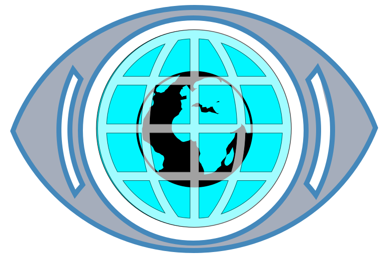

# GlobeLocation Studio 🌍🎬

> **Cinematic location videos from a place, route, or story prompt.**  
> A production-oriented video creation studio powered by CesiumJS, adapted from the 3D globe and camera concepts in [God's Eye View](https://github.com/bilawalsidhu/gods-eye-view).



GlobeLocation Studio transforms geographic coordinates, places, and route paths into high-definition, export-ready cinematic video clips for YouTube educators, travel creators, real-estate explainers, and documentary storytellers.

---

## ⚡ Creator Workflow

```
Enter location / paste coordinates / select preset
                    ↓
         Choose a video template
                    ↓
   Set camera path, duration, labels & visual style
                    ↓
    Interactive preview & timeline scrubbing
                    ↓
   Render & download high-res MP4/WebM video
```

---

## 🚀 Key Features

### 1. 6 Cinematic Video Templates
- **Globe to Place**: Dramatic 16,000,000m orbit-to-ground dive with atmospheric entry, logarithmic altitude deceleration, and title reveal.
- **Place Reveal**: Smooth 360° or 90° aerial pan/orbit drone shot showcasing elevation and architectural landmarks.
- **Route Flyover**: Forward-facing flight along multi-waypoint 3D trajectories with glowing animated ribbons and elevation changes.
- **Multi-Stop Story**: Chapter-by-chapter sequential journeys connecting 2 to 10 worldwide locations.
- **Region Explainer**: High-altitude territorial overview highlighting country/state borders and geographic callouts.
- **Before / After Context**: Seamless two-phase perspective comparison between macro establishing views and ground-level detail.

### 2. Multi-Format Framing & Safe Areas
- **16:9 Landscape** (1920×1080) for YouTube, documentaries, and desktop video.
- **9:16 Vertical** (1080×1920) for TikTok, YouTube Shorts, and Instagram Reels.
- **1:1 Square** (1080×1080) for social feeds.
- **Framing Guides Overlay**:
  - Live Letterbox / Pillarbox crop masks
  - **Action-Safe Area (90%)**
  - **Title-Safe Area (80%)**
  - **Rule of Thirds** grid alignment
  - Center crosshair targeting

### 3. 4 Curated Visual Themes
- **Clean Documentary**: High-clarity daylight satellite imagery (Esri World Imagery) with subtle atmospheric scattering and white frosted typography.
- **Satellite Cinematic**: Dramatic low sun angle, solar terminator, high-altitude bloom, and cyber-gold accents.
- **Minimal Vector / Map**: Clean OpenStreetMap cartography with crisp architectural contrast.
- **Dark Data / Explainer**: Midnight aesthetic with neon cyan and amber glowing beacon pins and illuminated trajectory lines.

### 4. Interactive Timeline & Scrubber
- Real-time 60fps camera interpolation playback.
- Spacebar play/pause shortcut.
- Microsecond-accurate scrubbing with keyframe event markers.
- Motion easing curves: **Cubic In/Out**, **Linear Drone**, **Dramatic Exponential**, **Slow In**, and **Slow Out**.
- Configurable duration (3s to 25s) and frame rates (24, 30, 60 fps).

### 5. Client-Side Video Capture & Audio
- High-bitrate video encoding (16 Mbps) via `MediaRecorder` (VP9/H.264).
- Offscreen 2D compositing engine that draws the 3D WebGL globe, animated title cards, location badges, and subtle attribution watermarks.
- Built-in **Procedural Ambience Synthesizer** (Web Audio API) generating license-free 50Hz sub-bass cinematic drone and spatial wind effects multiplexed directly into the exported video stream.
- Instant 1-click **4K/HD PNG Snapshot** still frame capture.

### 6. Standardized Scene JSON Format
Portable, versioned JSON scene definition format matching `pr.md`:

```json
{
  "version": 1,
  "name": "Mount Everest Expedition",
  "format": {
    "aspectRatio": "16:9",
    "width": 1920,
    "height": 1080,
    "fps": 30,
    "durationSeconds": 12
  },
  "template": "route-flyover",
  "theme": "documentary",
  "camera": {
    "start": { "longitude": 86.852, "latitude": 27.995, "height": 7500, "heading": 95, "pitch": -20 },
    "end": { "longitude": 86.925, "latitude": 27.988, "height": 9600, "heading": 110, "pitch": -30 },
    "easing": "cubicInOut",
    "waypoints": [ ... ]
  },
  "overlays": [
    {
      "id": "pin-everest",
      "type": "pin",
      "latitude": 27.9881,
      "longitude": 86.9250,
      "label": "Mt. Everest Summit",
      "color": "#f59e0b",
      "pulse": true
    }
  ],
  "timeline": [
    {
      "at": 1.5,
      "action": "showTitle",
      "text": "Mount Everest Expedition",
      "subtext": "Ascent to the Roof of the World",
      "position": "lower-third"
    }
  ]
}
```

### 7. Headless / Clean Render Mode
To support automated batch rendering or OBS screen capture:
```bash
# Clean fullscreen render player (hides editing GUI chrome)
http://localhost:5173/?render=1

# Autoplay on load
http://localhost:5173/?render=1&autoplay=1

# Load custom scene via URL
http://localhost:5173/?scene=%7B...%7D
```
The application also exposes `window.__GLOBE_STUDIO__` for programmatic control via Puppeteer or Playwright workers.

---

## 🛠️ Quickstart

### Prerequisites
- Node.js (v18+ or v20+)
- npm or pnpm

### Installation
```bash
# Clone or navigate to the workspace
cd globelocation

# Install dependencies
npm install

# Start local studio
npm run dev
```
Open **[http://localhost:5173/](http://localhost:5173/)** in your browser.

### Production Build
```bash
npm run build
npm run preview
```

---

## 📜 Data Sources & Licensing

- **Globe Engine**: [CesiumJS](https://cesium.com/) (Apache 2.0 License).
- **Satellite Imagery**: Powered by Esri. Sources: Esri, Maxar, Earthstar Geographics, USDA, USGS, AeroGRID, IGN, and the GIS User Community.
- **Vector Cartography**: © [OpenStreetMap](https://www.openstreetmap.org/) contributors under ODbL.
- **Geocoding**: OpenStreetMap Nominatim.
- **Attribution**: Video exports automatically retain proper source attribution badges in compliance with map provider licensing terms.

---

*Built with precision for content creators, geographic journalists, and storytellers.*

---

## 🎞️ Documentary renders (clean plates)

`scripts/render-scene.js` renders a scene JSON headlessly with no prompt step, for pipelines that decide every place and camera move themselves (the documentaries pipeline calls it from `pipeline/globe.py`):

```bash
node scripts/render-scene.js --scene scene.json --out clip.mp4          # + clip.track.json
node scripts/render-scene.js --scene scene.json --stills 0,0.5,1 --stills-dir preview/
```

Scene fields it relies on:

- `"cleanPlate": true`: the globe alone. No pins, routes, titles or watermark; the caller draws its own.
- `"imagery": "usgs" | "bluemarble" | "naturalearth"`: public-domain imagery that overrides the theme's. `naturalearth` is Natural Earth II alone (whole globe, bundled with Cesium, offline, soft up close); `bluemarble` adds NASA Blue Marble: Next Generation from NASA GIBS (whole globe, sharp to regional scale); `usgs` adds the USGS National Map orthoimagery from web-mercator zoom 9 down (USDA NAIP, United States only). The report prints the credit.
- `"time": "2014-06-15T18:00:00Z"` fixes the sun, so the lighting doesn't depend on when the scene is rendered; `"lighting": false` turns it off.
- `"track": {"points": {id: [lon, lat]}, "lines": {id: [[lon, lat], ...]}}`: every frame's screen position of each point, as `[x, y, visible]` in export pixels, written to `<out>.track.json` so the caller can draw labels and routes that stay locked to the ground.

The last stdout line is a JSON report: `out`, `track`, `frames`, `stalledFrames` (frames rendered before every tile arrived) and `imageryCredit`.
